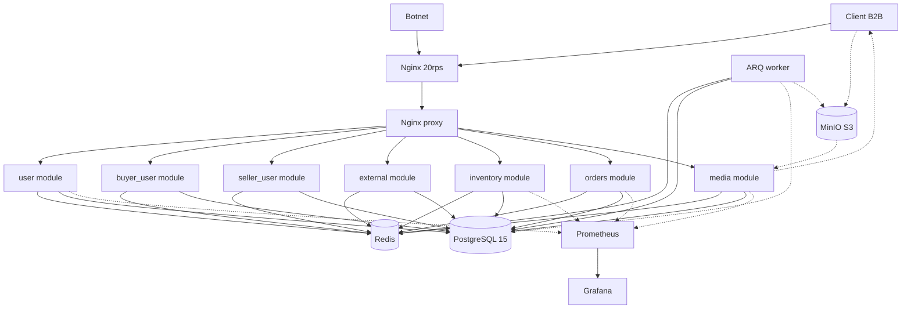

# System Architecture

FairDrop uses a modular monolith architecture with nginx gateway, async FastAPI services, PostgreSQL, Redis, MinIO, and ARQ workers.

## Components

| Layer | Component | Description |
|---|---|---|
| **Perimeter** | Nginx Gateway | Rate limiting 20r/s, IP whitelist for webhooks |
| **App** | FastAPI | 8 modules: user, buyer_user, seller_user, external, inventory, orders, media, payments |
| **Background** | ARQ Worker | Cron cleanup expired reservations, image sanitization |
| **Storage** | PostgreSQL 15 | Async SQLAlchemy, pool 200+ |
| **Cache** | Redis | Lua rate limiting, ARQ queues, idempotency keys |
| **Storage** | MinIO S3 | Object storage for media |
| **Monitoring** | Prometheus + Grafana | Metrics via prometheus-fastapi-instrumentator |
