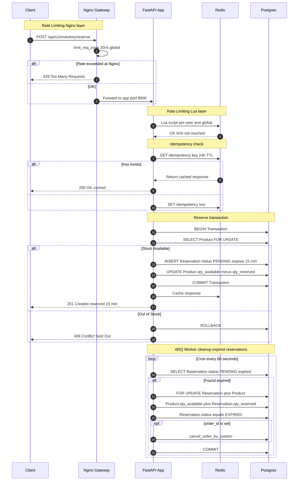

# Request Flow — Inventory Reservation

Sequence diagram showing the complete inventory reservation flow including rate limiting, idempotency, and ARQ cleanup.

## Flow Steps

1. **Nginx rate limit** — global 20r/s filter at gateway level
2. **Lua rate limit** — per-user 10 RPS + global 1000 RPS in Redis
3. **Idempotency check** — Redis cache with 24h TTL prevents duplicate orders
4. **Reserve transaction** — `SELECT FOR UPDATE` locks product row, creates PENDING reservation for 15 min
5. **ARQ cleanup** — cron job runs every 60 seconds, releases expired reservations and returns stock
